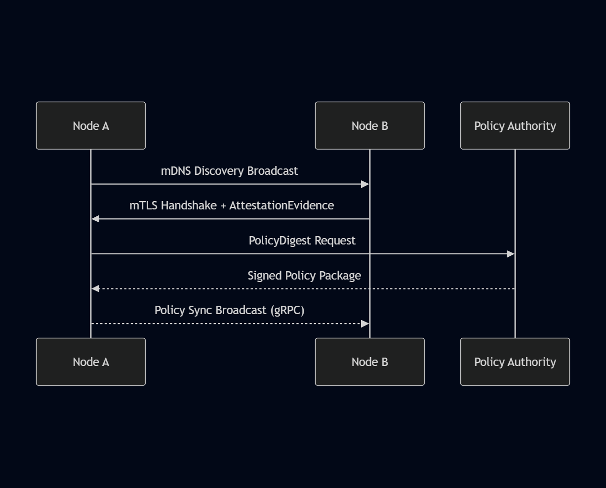

# SG-X Guardian Client — API Specification v1.0
**Version:** v1.0 — November 2025  

---

## Overview
This document defines the core **gRPC service contracts** and message structures for the **SG-X Guardian Client**.  
It also illustrates the end-to-end communication sequence between **edge nodes** and the **Policy Authority**.

---

## Protobuf Schemas

| Service | File | Purpose |
|----------|------|----------|
| **PeerService** | `/proto/peer.proto` | Handles peer discovery and mDNS handshake |
| **PingService** | `/proto/ping.proto` | Performs health and latency checks |
| **PolicyService** | `/proto/policy.proto` | Handles signed policy distribution and validation |

All `.proto` files use **syntax = "proto3"** and are compiled during the build step (`build.rs` → `src/proto/`).

---

## Message Overview

| Message | Description |
|----------|-------------|
| **PeerInfo** | Identifies each node in the Circle of Trust |
| **HandshakeRequest / Response** | Used for attestation handshake |
| **PolicyDigest / PolicyBlob** | Defines the policy state and signature validation |
| **PingRequest / PingReply** | Used by `PingService` for liveness and performance |

---

## Sequence Flow

Below is the complete API sequence for the **Circle of Trust Formation and Policy Synchronization**.

**Sequence Description:**
1. **Node A → Node B:** Broadcast mDNS service advertisement.  
2. **Node B → Node A:** Establish mutual TLS and exchange `AttestationEvidence`.  
3. **Node A → Policy Authority:** Request `PolicyDigest`.  
4. **Policy Authority → Node A:** Return `Signed Policy Package`.  
5. **Node A → Node B:** Broadcast updated policy over secure gRPC channel.

---

## Summary

The **API Specification v1.0** defines:
- Complete gRPC schemas for **Peer**, **Ping**, and **Policy** services.  
- Core data structures for discovery, attestation, and policy management.  
- Full interaction flow validated through the **sequence diagram above**.

Together, these elements satisfy the **API Spec v1.0 deliverable** of Phase 1.
