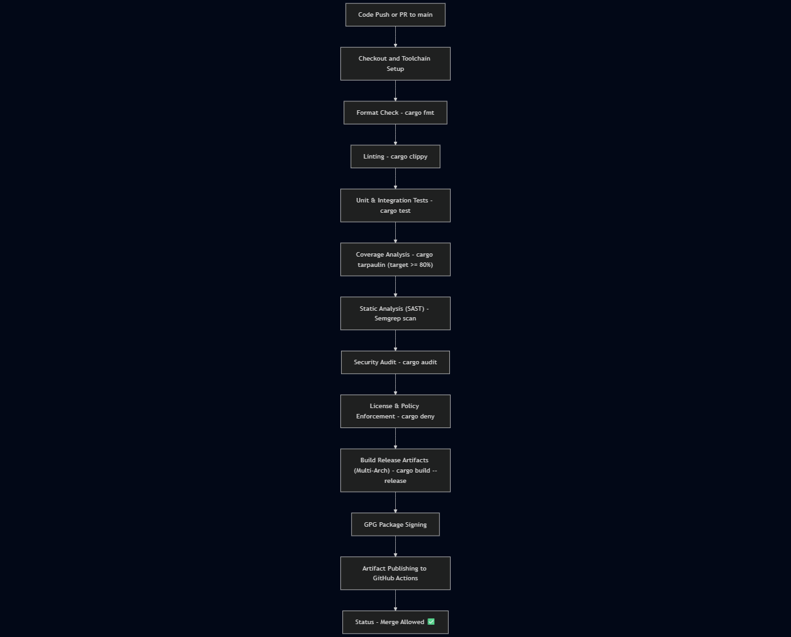

# CI/CD Pipeline Documentation

## Overview

This document describes the Continuous Integration and Continuous Deployment (CI/CD) pipeline for the **SG-X Guardian Client** project.  
The pipeline ensures that all code changes meet strict quality, security, and compliance requirements before merging into the `main` branch.

The CI/CD workflow is implemented using **GitHub Actions** and is automatically triggered on every push or pull request targeting `main`.

---

## Pipeline Architecture Diagram

The SG-X Guardian Client CI/CD pipeline follows a linear, gated flow where each stage must pass before the next begins.  
Below is the architecture diagram illustrating the build, test, and deployment flow.

---

## Pipeline Location

- **File:** `.github/workflows/ci.yml`
- **Runs:** Automatically on:
  - Every push to `main`
  - Every pull request targeting `main`

---

## Pipeline Stages

| Stage | Tool | Purpose | Fails Build If |
|-------|------|----------|----------------|
|  Format Check | `cargo fmt` | Ensures consistent code style | Code is not properly formatted |
|  Linting | `cargo clippy` | Detects unsafe or inefficient code | Any lint warning occurs |
|  Unit Testing | `cargo test` | Verifies functionality of core components | Any test fails |
|  Coverage Analysis | `cargo tarpaulin` | Tracks test coverage (target ≥ 80%) | Coverage report generation fails |
|  Security Audit | `cargo audit` | Detects known dependency vulnerabilities | Any vulnerability is found |
|  License & Policy Enforcement | `cargo deny` | Validates allowed licenses and security policies | Any violation detected |
|  Static Analysis (Semgrep) | `semgrep` | Detects insecure or bad-practice code patterns | Any critical finding |
|  Artifact Build | `cargo build --release` | Produces optimized binaries for deployment | Compilation fails |
|  Multi-Architecture Build | GitHub Actions Matrix | Builds on multiple OS environments (Linux & Windows) | Any architecture job fails |
|  Package Signing | `gpg` | Signs compiled artifacts for authenticity | Signature process fails |
|  Artifact Upload | GitHub Actions | Publishes binaries and coverage reports | Upload fails |

---

## Tools and Commands

The following tools are installed and used as part of the pipeline:

- **Rust stable toolchain** – Core compiler  
- **cargo fmt** – Code formatting  
- **cargo clippy** – Linting and static analysis  
- **cargo test** – Unit testing  
- **cargo tarpaulin** – Test coverage reporting  
- **cargo audit** – Security vulnerability scanning  
- **cargo deny** – License and security policy enforcement  

---

## Workflow Execution

1. **Checkout:** Fetch repository source  
2. **Install Toolchain:** Rust stable + formatting & linting components  
3. **Install Dependencies:** Cache Cargo registry and git sources  
4. **Run Quality Checks:** Formatting & linting validation  
5. **Execute Tests:** Unit and integration tests  
6. **Measure Coverage:** Coverage report generated  
7. **Perform Security & License Scans:** `cargo audit`, `cargo deny`  
8. **Run Static Analysis:** Semgrep scan  
9. **Multi-Arch Build & Sign Artifacts:** The pipeline compiles and signs release binaries across multiple operating systems (Linux and Windows) in parallel, ensuring portability and reproducibility.
10. **Upload Results:** Push artifacts and coverage report to GitHub  

---

## Pipeline File Structure

.github/
└── workflows/
    └── ci.yml ← CI/CD pipeline definition
docs/
└── CI/CD_Pipeline_Documentation.md ← This documentation

---

## Branch Protection Rules

The following branch protection rules are recommended and enforced:

- `main` branch is protected  
- Pull requests require at least one review  
- All CI/CD checks must pass before merge  
- All commits must be GPG-signed  
- Each commit must reference an issue number for traceability  

---

## Deployment Stage Summary

The current pipeline includes a secure artifact build and signing phase:

- **GPG Package Signing:** Confirms binary integrity and provenance.  
- **Artifact Publishing:** Uploads signed build outputs and coverage reports to GitHub.  

This stage guarantees that **only verified, signed, and reproducible builds** are available for deployment or demonstration.

---

## Troubleshooting Guide

| Issue | Cause | Solution |
|-------|-------|-----------|
|  Formatting check fails | Code not formatted | Run `cargo fmt` locally |
|  Clippy errors | Lint violations | Fix warnings from `cargo clippy` |
|  Tests fail | Broken logic | Fix and re-run tests |
|  Coverage below 80 % | Missing tests | Add test cases |
|  Audit fails | Vulnerable crate | Update or patch dependency |
|  License check fails | Unapproved license | Update `deny.toml` to allow or replace crate |
|  GPG key error | Missing secret key | Re-import key in repository secrets |

---

## Summary

This CI/CD pipeline ensures that:
- Every code change is tested, linted, formatted, and security-checked before merge.  
- The `main` branch remains **protected, green, and always deployable**.  
- All artifacts are **signed, traceable, and compliant** with license and security policies.

