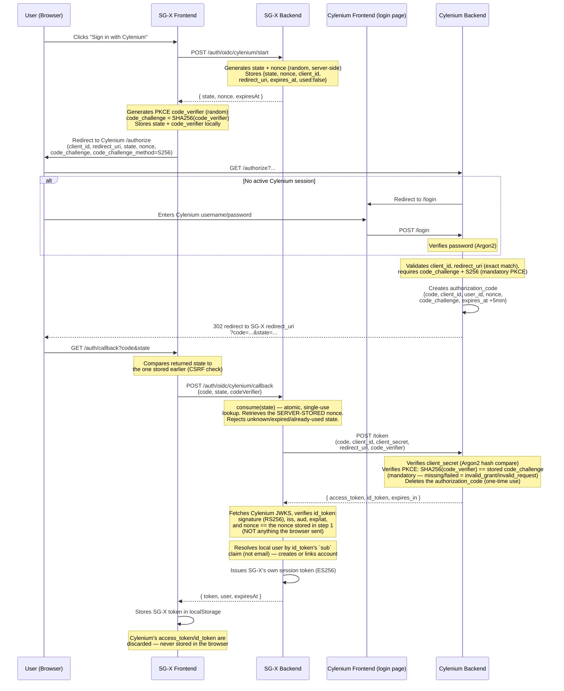
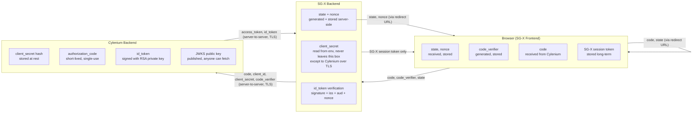

# SG-X ↔ Cylenium Single Sign-On — Complete Explanation

This document explains, in plain language, how "Sign in with Cylenium" works
across the four moving parts of this system:

- **SG-X Frontend** — the React/Vite app the user clicks buttons in (`SGX/frontend`, source of truth `SGX Frontend/`)
- **SG-X Backend** — the Rust/Axum server (`SGX/src/api`)
- **Cylenium Backend** — the identity provider (IdP) that actually checks the user's password (`Cylenium/src`)
- **Cylenium Frontend** — Cylenium's own login/register HTML pages, served by the same Cylenium backend

It covers the protocol, every credential involved, a step-by-step diagram,
what changes for production, and the API endpoints on both sides.

---

## 1. The protocol, in one paragraph

SG-X does **not** ask the user for a Cylenium password, and Cylenium never
sees an SG-X password either. Instead they use **OpenID Connect (OIDC)** —
a thin identity layer on top of **OAuth2** — using the **Authorization Code
flow with mandatory PKCE**. The short version: the browser is bounced from
SG-X to Cylenium to log in, Cylenium hands back a one-time-use `code`
through the browser, and then SG-X's *backend* (never the browser) trades
that `code` directly with Cylenium's backend for a signed proof of identity
(the `id_token`). The browser is just a courier for the `code` — it never
sees a password, a client secret, or a long-lived token from Cylenium.

---

## 2. Every credential and value, explained

| Name | What it is | Who generates it | Who sees it | Secret? |
|---|---|---|---|---|
| `client_id` | Public "username" for the SG-X app itself, registered with Cylenium | Cylenium, at client registration | Everyone (it's in the URL) | No |
| `client_secret` | "Password" that proves a request is really coming from SG-X's backend | Cylenium, at client registration | Only SG-X's backend and Cylenium's backend | **Yes** |
| `redirect_uri` | The exact URL Cylenium is allowed to send the browser back to after login | Configured once, matched exactly (no wildcards) | Public | No |
| `state` | Random, one-time value that ties this specific login attempt back to the browser that started it | SG-X **backend** (not the browser) | Public (round-trips through the browser and the URL) | No, but must be unpredictable |
| `nonce` | Random, one-time value embedded inside the signed `id_token` itself | SG-X **backend**, same time as `state` | Public (visible in the URL and inside the JWT) | No, but must be unpredictable |
| `code` | Short-lived (5 minutes), single-use authorization code | Cylenium, after the user logs in | Browser, then SG-X backend | Semi-secret, single-use |
| `code_verifier` (PKCE) | A random secret the *browser* makes up for this one login | SG-X frontend | Only the browser, until it sends it to SG-X's own backend | Yes, but per-attempt |
| `code_challenge` (PKCE) | SHA-256 hash of `code_verifier`, sent up front | SG-X frontend | Public | No (it's a hash) |
| `access_token` | Opaque token for calling Cylenium's own APIs | Cylenium, at token exchange | SG-X backend only | Yes |
| `id_token` | A signed JWT saying "this user authenticated at Cylenium" — the actual identity proof | Cylenium, at token exchange | SG-X backend only | Signed, not encrypted |
| `sub` | The permanent, unique user ID inside the `id_token` | Cylenium | SG-X backend | No |
| SG-X session token | SG-X's *own* bearer token, issued after everything above succeeds | SG-X backend | Browser (stored in `localStorage`) | Yes |

**Why `client_id` is public but `client_secret` is not:** `client_id`
just says *which app* is asking — like a storefront name. `client_secret`
proves *that specific backend* is really SG-X and not an impostor
pretending to be SG-X. It is only ever transmitted directly
backend-to-backend over TLS (SG-X server → Cylenium server), and it is
never sent to, or stored in, the browser.

**Why both `state` and `nonce` exist — they solve different problems:**
- `state` stops **login CSRF**: without it, an attacker could start their
  own login at Cylenium, capture the resulting `code`, and trick a victim's
  browser into "completing" that login — silently logging the victim into
  the attacker's account. Binding `state` to a value SG-X's backend stored
  *before* redirecting closes that.
- `nonce` stops **ID-token replay/substitution**: it proves the specific
  `id_token` SG-X received was minted for *this* request, not copied from
  a different, unrelated login. It only matters once the token is decoded
  and checked — `state` matters at the browser round-trip, `nonce` matters
  at token verification.

**Why PKCE (`code_verifier`/`code_challenge`) exists on top of `state`:**
`state` proves the browser round-trip wasn't hijacked. PKCE proves that
*whoever redeems the `code`* is the same party that started the flow —
even if the `code` leaks in transit (e.g. through browser history, a proxy
log, or a malicious app intercepting the redirect on the same device), it's
useless without the matching `code_verifier`, which never left the
browser/backend pair that generated it.

---

## 3. Encryption and cryptographic building blocks used

| Purpose | Algorithm | Where |
|---|---|---|
| Transport encryption | TLS (HTTPS) | Browser↔SG-X, Browser↔Cylenium, SG-X↔Cylenium server calls (must be enforced in production — see §5) |
| Cylenium `id_token` signing | **RS256** (RSA + SHA-256) | Cylenium signs with `keys/private.pem`; SG-X verifies using Cylenium's public key from its JWKS endpoint |
| SG-X's own session token signing | **ES256** (ECDSA P-256 + SHA-256) | Signed with the SG-X device's own key (`KeyManager`); never sent to or trusted by Cylenium |
| PKCE challenge | **SHA-256**, base64url-encoded | `code_challenge = base64url(SHA256(code_verifier))` |
| `state` / `nonce` generation | Cryptographically secure RNG, 32 random bytes, base64url | Generated server-side by SG-X's backend |
| User passwords (both apps) | **Argon2id** (salted, memory-hard hash) | Never stored or compared as plaintext |
| Cylenium `client_secret` | **Argon2id** hash at rest, `verify_password` at the `/token` endpoint | Was plaintext-compared before a recent fix — now hashed |

**Important nuance on "encryption":** the `id_token` is *signed*, not
*encrypted*. Anyone who intercepts it can read its contents (email, name,
`sub`, etc. — it's a plain base64 JSON payload), but they **cannot forge or
alter it** without Cylenium's private key. That's why TLS in transit still
matters even though the token is already tamper-evident: signing stops
forgery, TLS stops eavesdropping.

---

## 4. Step-by-step workflow diagram

### Where each credential physically travels

The key thing this diagram shows: **`client_secret` and the raw
`id_token`/`access_token` never touch the browser.** The browser only ever
holds `state`, `code_verifier`, the one-time `code`, and — at the very
end — SG-X's *own* session token, which has nothing to do with Cylenium's
signing keys.

---

## 5. What changes for production

### 5.1 SG-X Backend environment variables

| Variable | Dev value (typical) | Production value |
|---|---|---|
| `SGX_CYLENIUM_OIDC_ISSUER` | `http://localhost:4000` | Cylenium's real HTTPS issuer URL, must match Cylenium's `iss` claim **exactly** (string-for-string) |
| `SGX_CYLENIUM_OIDC_TOKEN_ENDPOINT` | `http://localhost:4000/token` | `https://<cylenium-domain>/token` |
| `SGX_CYLENIUM_OIDC_JWKS_URI` | `http://localhost:4000/.well-known/jwks.json` | `https://<cylenium-domain>/.well-known/jwks.json` |
| `SGX_CYLENIUM_OIDC_CLIENT_ID` | dev client id | Production client id, issued via `POST /clients` against production Cylenium |
| `SGX_CYLENIUM_OIDC_CLIENT_SECRET` | dev secret | Production secret — **generate fresh, store in a secrets manager, never commit** |
| `SGX_CYLENIUM_OIDC_REDIRECT_URI` | `http://localhost:5173/auth/callback` | `https://<sgx-production-domain>/auth/callback` — must be registered on Cylenium's `redirect_uris` allowlist exactly |

### 5.2 SG-X Frontend (Vite) environment variables

| Variable | Dev value | Production value |
|---|---|---|
| `VITE_CYLENIUM_BASE_URL` | `http://localhost:4000` | `https://<cylenium-domain>` |
| `VITE_CYLENIUM_CLIENT_ID` | dev client id | Same production client id as the backend's `SGX_CYLENIUM_OIDC_CLIENT_ID` |
| `VITE_CYLENIUM_REDIRECT_URI` | `http://localhost:5173/auth/callback` | Same as `SGX_CYLENIUM_OIDC_REDIRECT_URI` above |
| `VITE_CYLENIUM_SCOPE` | `openid profile email` | Usually unchanged |
| `VITE_API_URL` | local SG-X backend URL | Production SG-X backend URL |

Note: `VITE_*` values are **baked into the built JS bundle at compile
time** (Vite), not read at runtime — they must be set before `npm run
build`, not just before the server starts.

### 5.3 Cylenium — code changes needed, not just env vars

This is the important part: two values Cylenium needs in production are
currently **hardcoded Rust constants**, not environment variables. Setting
an env var alone will not change them — the source needs a small edit
first:

- `ISSUER: &str = "http://localhost:4000"` — in both
  `Cylenium/src/services/token_service.rs` and
  `Cylenium/src/handlers/discovery.rs`. This value is signed *into* every
  `id_token`'s `iss` claim and is also advertised in the
  `/.well-known/openid-configuration` discovery document. If it doesn't
  exactly match what SG-X is configured to expect
  (`SGX_CYLENIUM_OIDC_ISSUER`), every login will fail issuer validation.
- `PRIVATE_KEY_PATH: &str = "keys/private.pem"` and
  `KEY_ID: &str = "cylenium-key-1"` — the signing key location and its
  JWKS `kid`. In production this key must be provisioned securely (not
  committed to git) and rotated with a real `kid` strategy so old tokens
  don't suddenly fail verification mid-rotation.

Cylenium's actual env var is just the bind address:

| Variable | Dev value | Production value |
|---|---|---|
| `CYLENIUM_ADDR` | unset → defaults to `127.0.0.1:4000` | Bind address behind your TLS-terminating reverse proxy (Cylenium itself serves plain HTTP — it does not terminate TLS) |

### 5.4 Other production items worth checking off

- Put a TLS-terminating reverse proxy in front of Cylenium (it only speaks
  plain HTTP itself).
- Re-register SG-X as a Cylenium client for the production
  `redirect_uri` — a dev-registered client's redirect allowlist won't
  match a production domain.
- Rotate/generate a fresh `client_secret` for production; don't reuse the
  dev one.
- Confirm `data/clients.json`, `data/authorization_codes.json`, and
  SG-X's `oidc_transactions.json` all live on persistent, backed-up
  storage in production (they're currently flat JSON files on disk).

---

## 6. API endpoints

### 6.1 SG-X Backend — auth / OIDC endpoints

| Method | Path | Auth required? | Purpose |
|---|---|---|---|
| POST | `/api/v1/auth/signup` | No (public) | Create the first local owner account (password-based) |
| POST | `/api/v1/auth/login` | No (public) | Local email/password login |
| POST | `/api/v1/auth/oidc/cylenium/start` | No (public) | Generates and stores `state`/`nonce` server-side, returns them so the frontend can build the Cylenium `/authorize` URL |
| POST | `/api/v1/auth/oidc/cylenium/callback` | No (public) | Consumes the `state`, exchanges `code` with Cylenium, verifies the `id_token`, resolves/creates the local user, issues an SG-X session |
| POST | `/api/v1/auth/logout` | Yes | Revokes the current SG-X session |
| GET | `/api/v1/auth/session` | Yes | Validates the current bearer token, returns the logged-in user |

(SG-X exposes many other API groups — devices, chat, calls, vault, threat
detection, policy, etc. — that are unrelated to the Cylenium login feature
and are out of scope for this document.)

### 6.2 Cylenium Backend — full route table

| Method | Path | Purpose |
|---|---|---|
| GET | `/register` | Cylenium's own HTML registration page |
| POST | `/register` | Create a Cylenium user account |
| GET | `/login` | Cylenium's own HTML login page |
| POST | `/login` | Authenticate a Cylenium user, starts a Cylenium session |
| GET | `/login/success` | Post-login landing page |
| POST | `/logout` | Ends a Cylenium session |
| GET | `/authorize` | **OIDC authorization endpoint** — starts a login for a registered client, mandates PKCE, redirects back with a `code` |
| POST | `/token` | **OIDC token endpoint** — exchanges a `code` (+ PKCE `code_verifier` + `client_secret`) for `access_token`/`id_token` |
| GET | `/.well-known/openid-configuration` | OIDC discovery document (issuer, endpoints, supported scopes/algorithms) |
| GET | `/.well-known/jwks.json` | Published public keys, used by SG-X to verify `id_token` signatures |
| POST | `/clients` | Register a new OAuth/OIDC client application (like SG-X) |
| GET | `/clients` | List all registered client applications |
| GET | `/clients/{client_id}` | Get one registered client's details |
| DELETE | `/clients/{client_id}` | Disable a registered client |

---

## 7. Glossary (quick reference)

- **OAuth2** — a framework for delegated *authorization* ("can this app do
  X on my behalf").
- **OIDC** — an identity layer built on top of OAuth2, adding *who logged
  in* (`id_token`, `sub`, `nonce`).
- **JWT** — a signed (and optionally encrypted) JSON payload; here it's
  signed but readable, not encrypted.
- **JWKS** — a published set of public keys a service can use to verify
  someone else's JWTs without contacting them.
- **PKCE** — "Proof Key for Code Exchange" — the `code_verifier`/
  `code_challenge` pair that binds a token exchange to whoever started the
  login.
- **Confidential client** — an app (like SG-X's backend) trusted to hold a
  `client_secret` safely, unlike a browser or mobile app.
- **IdP** — Identity Provider — Cylenium, in this system.
- **RP** — Relying Party — SG-X, in this system (it *relies on* Cylenium's
  identity assertion).
