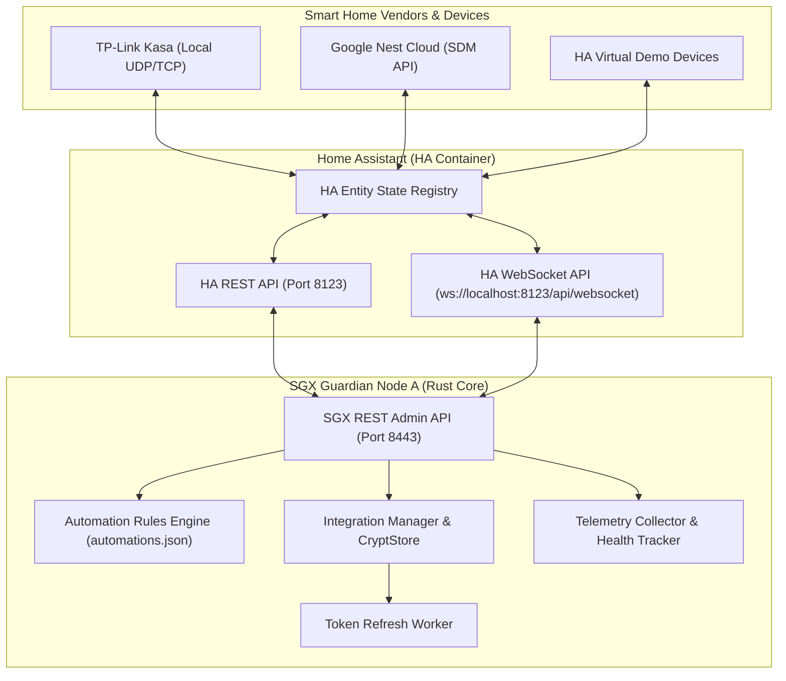

# SGX Guardian — End-to-End Smart Home Integration Testing Guide

> **Audience:** Senior QA Engineers, Integration Testers, Field Deployment Technicians, and Software Engineers.  
> **Level:** Beginner to Advanced (Self-Contained Onboarding Manual).  
> **Note on Security:** As per internal test environment configuration (`SGX_DISABLE_LOGIN=1`), API requests in this manual do not require bearer authorization headers.

---

## Table of Contents
1. [Project Overview](#1-project-overview)
2. [Prerequisites](#2-prerequisites)
3. [Environment Setup](#3-environment-setup)
4. [Pre-Test Checklist](#4-pre-test-checklist)
5. [Testing Methodology](#5-testing-methodology)
6. [Test Cases](#6-test-cases)
7. [Verification Guide](#7-verification-guide)
8. [Expected Outputs](#8-expected-outputs)
9. [Negative Testing](#9-negative-testing)
10. [Edge Cases](#10-edge-cases)
11. [Troubleshooting Guide](#11-troubleshooting-guide)
12. [Validation Checklist](#12-validation-checklist)
13. [Acceptance Criteria](#13-acceptance-criteria)
14. [Best Practices](#14-best-practices)
15. [Documentation Standards](#15-documentation-standards)

---

## 1. Project Overview

### 1.1 What the Platform Does
**SGX Guardian** is a high-assurance, secure smart home edge orchestration platform. It operates as an enclave-secured middleware agent running alongside **Home Assistant (HA)**. It bridges local smart home hardware (TP-Link Kasa, Z-Wave, Zigbee) and cloud-connected platforms (Google Nest, Ecobee) into a zero-trust encrypted mesh network.

Key capabilities include:
- **Zero-Trust Token Security:** AES-GCM-256 encrypted credential storage (`integrations.json`).
- **Real-Time State Reconciliation:** Sub-second state syncing via Home Assistant WebSocket stream.
- **Cross-Vendor Automation Engine:** Dynamic event-driven rules engine evaluating triggers and executing service calls.
- **Telemetry & Health Monitoring:** Continuous monitoring of device reachability, battery metrics, and energy consumption.

### 1.2 System Architecture Diagram


---

## 2. Prerequisites

### 2.1 Hardware Requirements
- **Host Workstation:** x86_64 / ARM64 multi-core CPU (Minimum 4 cores, 8 GB RAM).
- **Network Interface:** Wi-Fi or Ethernet adapter on local LAN.

### 2.2 Software & OS Requirements
- **Operating System:** Linux (Ubuntu 20.04+, Debian 11+) or Windows 10/11 with WSL2 (Ubuntu 22.04 LTS).
- **Runtime Dependencies:**
  - Docker Engine v24.0+ & Docker Compose v2.20+
  - Rust Toolchain v1.75+ (`cargo`, `rustc`)
  - Python 3.10+ (for mock device simulation scripts)
  - `curl` CLI utility v7.80+

### 2.3 Required Credentials & Environment Variables
| Key | Purpose | Required For |
| :--- | :--- | :--- |
| `HA_URL` | Base URL of local Home Assistant instance | All HA REST & WebSocket calls |
| `HA_TOKEN` | Long-Lived Access Token generated from HA UI | Authentication with HA REST/WS |
| `SGX_NEST_PROJECT_ID` | Device Access Console Project ID | Google Nest SDM OAuth |
| `SGX_NEST_CLIENT_ID` | GCP OAuth 2.0 Web Client ID | Google Nest SDM OAuth |
| `SGX_NEST_CLIENT_SECRET`| GCP OAuth 2.0 Web Client Secret | Google Nest Token Exchange |

---

## 3. Environment Setup

### Step 1: Clone Repository & Verify File Structure
Navigate to the root directory `/home/hp/SGX`:
```bash
cd /home/hp/SGX
ls -la
```
Ensure the following files exist:
- `docker-compose.ha.yml` (Home Assistant Docker configuration)
- `.env` (Environment secrets file)
- `ha-dev-config/configuration.yaml` (Home Assistant configuration)

### Step 2: Start Home Assistant Container
Launch Home Assistant in detached mode:
```bash
docker compose -f docker-compose.ha.yml up -d
```
Verify container status:
```bash
docker ps --filter "name=homeassistant"
```

### Step 3: Configure Home Assistant & Generate Access Token
1. Open your browser and navigate to: **`http://127.0.0.1:8123`**
2. Complete the initial onboarding wizard (create admin user).
3. Click your **User Profile Icon** at the bottom-left corner of the sidebar.
4. Scroll down to **Long-Lived Access Tokens** and click **Create Token**.
5. Name the token `sgx-guardian` and copy the generated token string.

### Step 4: Configure `.env` File
Update `/home/hp/SGX/.env` with your token:
```env
HA_URL=http://127.0.0.1:8123
HA_TOKEN=paste_your_long_lived_access_token_here
SGX_NEST_PROJECT_ID=be666f67-3423-4a5d-b82d-38ec2865e1fa
SGX_NEST_CLIENT_ID=826937801762-i23ak49q222h42sffqmgvemb9pnl5jvr.apps.googleusercontent.com
SGX_NEST_CLIENT_SECRET=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
```

### Step 5: Start SGX Guardian Server Node A
Launch SGX Guardian in test mode (`SGX_DISABLE_LOGIN=1` bypasses authorization requirements during QA):
```bash
sudo env "PATH=$PATH" "HOME=$HOME" SGX_DISABLE_LOGIN=1 cargo run -- nodeA
```
*Verify SGX starts cleanly on `https://localhost:8443`.*

---

## 4. Pre-Test Checklist

Before executing test cases, complete this verification checklist:

| Check Item | Command / Procedure | Expected Result | Pass/Fail |
| :--- | :--- | :--- | :--- |
| **HA HTTP Port** | `curl -s http://127.0.0.1:8123` | Returns HA HTML Dashboard | [ ] |
| **SGX REST API** | `curl -k https://localhost:8443/api/v1/ha/integrations` | Returns JSON status 200 OK | [ ] |
| **HA WebSocket** | Check SGX terminal logs | Log displays `✅ Connected to Home Assistant WebSocket!` | [ ] |
| **Python Simulator** | `python3 scratch/mock_kasa_plug.py` | UDP listener bound on port 9999 | [ ] |
| **Automations File**| Check `./automations.json` | Valid JSON array exists | [ ] |

---

## 5. Testing Methodology

### 5.1 Objectives & Scope
The QA methodology validates:
1. **Vendor Integration Handshakes:** Connect/Disconnect cycles for Google Nest, TP-Link Kasa, and Ecobee.
2. **Device Discovery & Control:** State sync from HA to SGX and execution of service calls (`turn_on`, `turn_off`, `set_temperature`).
3. **Automations Engine:** Event-driven trigger matching and cross-device action execution.
4. **Telemetry & Health Reporting:** Aggregation of device uptime, battery levels, and telemetry events.

### 5.2 Success & Failure Criteria
- **Pass Criteria:** API returns HTTP `200 OK` or `201 Created`, state in HA UI matches SGX state within 500ms, and telemetry log records the transition.
- **Fail Criteria:** HTTP status `40x`/`500`, state mismatch, unhandled socket disconnection, or panic in terminal logs.

---

## 6. Test Cases

### TC-01: Auto-Discover & Synchronize Devices
- **Feature:** Device Sync
- **Objective:** Verify SGX syncs all entities from Home Assistant into its local device registry.
- **Preconditions:** Home Assistant running with `demo:` integration enabled.
- **Execution Step:**
  ```bash
  curl -k -X POST https://localhost:8443/api/v1/ha/devices/sync
  ```
- **Expected Result:** HTTP 200 OK. Returns `"status": "synced"` with `total_devices > 0`.
- **Validation:**
  ```bash
  curl -k https://localhost:8443/api/v1/ha/devices
  ```

---

### TC-02: Device Control — Turn On Smart Light
- **Feature:** Device Command Execution
- **Objective:** Send command to turn on a light entity and verify state change.
- **Target Entity:** `light.bed_light`
- **Execution Step:**
  ```bash
  curl -k -X POST https://localhost:8443/api/v1/ha/devices/light.bed_light/command \
    -H "Content-Type: application/json" \
    -d '{
      "command": "turn_on",
      "params": { "brightness": 200 }
    }'
  ```
- **Expected Result:** HTTP 200 OK. Returns `"status": "pending"`. Light turns ON in HA UI.
- **State Check:**
  ```bash
  curl -k https://localhost:8443/api/v1/ha/devices/light.bed_light/state
  ```

---

### TC-03: TP-Link Kasa Cloud Connect & Status Verification
- **Feature:** Vendor Integration — TP-Link Kasa
- **Objective:** Connect TP-Link Kasa provider and verify encrypted token persistence.
- **Execution Step:**
  ```bash
  curl -k -X POST https://localhost:8443/api/v1/ha/integrations/tp_link_kasa/connect \
    -H "Content-Type: application/json" \
    -d '{
      "mode": "cloud",
      "username": "tester@kasa.com",
      "password": "SecretPassword123"
    }'
  ```
- **Expected Result:** HTTP 200 OK. Returns `"status": "connected"`.
- **Status Check:**
  ```bash
  curl -k https://localhost:8443/api/v1/ha/integrations/tp_link_kasa/status
  ```

---

### TC-04: Google Nest Mock Token Authorization
- **Feature:** Vendor Integration — Google Nest
- **Objective:** Connect Google Nest credentials and verify AES-GCM-256 storage.
- **Execution Step:**
  ```bash
  curl -k -X POST https://localhost:8443/api/v1/ha/integrations/google_nest/connect \
    -H "Content-Type: application/json" \
    -d '{
      "access_token": "mock_nest_access_token_abc123",
      "refresh_token": "mock_nest_refresh_token_xyz789",
      "expires_in_secs": 3600
    }'
  ```
- **Expected Result:** HTTP 200 OK. Returns `"status": "connected"`, `"has_credentials": true`.

---

### TC-05: Create & Execute Cross-Device Automation Rule
- **Feature:** Automation Rules Engine
- **Objective:** Create a rule that turns ON `light.bed_light` whenever `input_boolean.1` changes to `"on"`.
- **Step 1: Create Rule**:
  ```bash
  curl -k -X POST https://localhost:8443/api/v1/ha/automations \
    -H "Content-Type: application/json" \
    -d '{
      "id": "rule_sync_light",
      "name": "Auto Turn On Bed Light",
      "priority": 100,
      "enabled": true,
      "trigger": {
        "type": "state_changed",
        "entity_id": "input_boolean.1",
        "to_state": "on"
      },
      "conditions": [],
      "actions": [
        {
          "type": "command",
          "entity_id": "light.bed_light",
          "domain": "light",
          "command": "turn_on"
        }
      ]
    }'
  ```
- **Step 2: Trigger Automation**:
  ```bash
  curl -k -X POST https://localhost:8443/api/v1/ha/devices/input_boolean.1/command \
    -H "Content-Type: application/json" \
    -d '{ "command": "turn_on" }'
  ```
- **Expected Result:** Automation engine intercepts WebSocket event and automatically issues `turn_on` command to `light.bed_light`.

---

### TC-06: Query Telemetry Log History
- **Feature:** Telemetry Collector
- **Objective:** Retrieve timestamped state logs for an entity.
- **Execution Step:**
  ```bash
  curl -k "https://localhost:8443/api/v1/ha/telemetry/input_boolean.1?page=1&per_page=10"
  ```
- **Expected Result:** HTTP 200 OK. Returns array of historical state transitions sorted newest-first.

---

### TC-07: Query Device Health Summary
- **Feature:** Health & Monitoring
- **Objective:** Fetch system-wide health report.
- **Execution Step:**
  ```bash
  curl -k https://localhost:8443/api/v1/ha/device-health
  ```
- **Expected Result:** Returns total, online, offline, error device counts, and `healthy_percentage`.

---

## 7. Verification Guide

To verify proper system operation across all layers:

1. **Home Assistant Web UI (`http://127.0.0.1:8123`):**
   - Navigate to *Developer Tools $\rightarrow$ States*.
   - Filter by `light.bed_light` or `climate.demo_thermostat`.
   - Confirm state updates instantly when commands are sent via SGX API.

2. **SGX Real-Time REST APIs:**
   - Query integration registry: `curl -k https://localhost:8443/api/v1/ha/integrations`
   - Query notifications: `curl -k https://localhost:8443/api/v1/ha/notifications?unread=true`

3. **Terminal Execution Logs:**
   - Observe SGX Node A terminal output for WebSocket events:
     `✅ Connected to Home Assistant WebSocket!`
     `🔄 Received state update: entity_id=light.bed_light state=on`

---

## 8. Expected Outputs

| Operation | Expected API Response | Expected Log Entry | Expected UI Behavior |
| :--- | :--- | :--- | :--- |
| **Sync Devices** | `{"status":"synced"}` | `🔄 Reconciled X devices with HA` | Devices list populates |
| **Command (turn_on)** | `{"status":"pending"}` | `Dispatched command turn_on to entity` | Light/Switch turns ON |
| **Set Temp (23.5)** | `{"status":"pending"}` | `Dispatched set_temperature to climate` | Thermostat target = 23.5°C |
| **Disconnect Vendor** | `{"status":"disconnected"}` | `Cleared credentials for provider` | Status updates to disconnected |

---

## 9. Negative Testing

### NT-01: Non-Existent Device Command
- **Command:** `curl -k -X POST https://localhost:8443/api/v1/ha/devices/invalid_device_id/command -H "Content-Type: application/json" -d '{"command":"turn_on"}'`
- **Expected Result:** HTTP 404 Not Found. Payload: `{"error": "Device 'invalid_device_id' not found"}`.

### NT-02: Malformed JSON Automation Schema
- **Command:** `curl -k -X POST https://localhost:8443/api/v1/ha/automations -H "Content-Type: application/json" -d '{"invalid_key": true}'`
- **Expected Result:** HTTP 400 Bad Request.

### NT-03: Invalid Vendor Disconnect Provider
- **Command:** `curl -k -X POST https://localhost:8443/api/v1/ha/integrations/unknown_vendor/disconnect`
- **Expected Result:** HTTP 404 Not Found. Payload: `{"error": "Integration provider 'unknown_vendor' not found"}`.

---

## 10. Edge Cases

### EC-01: Home Assistant Container Restart During Active WebSockets
- **Procedure:** Restart HA docker container while SGX Node A is running (`docker restart homeassistant`).
- **Expected Behavior:** SGX WebSocket client detects socket drops, enters exponential backoff reconnect loop, and automatically re-authenticates once HA is back online without server crash.

### EC-02: Rapid Back-to-Back Command Burst
- **Procedure:** Issue 10 consecutive `turn_on` / `turn_off` commands to a single light in under 1 second.
- **Expected Behavior:** All commands queue and execute sequentially without race conditions or memory corruption.

---

## 11. Troubleshooting Guide

| Symptom | Cause | Diagnostic Command | Fix Procedure |
| :--- | :--- | :--- | :--- |
| `HTTP 401 Unauthorized` in HA logs | Expired or incorrect `HA_TOKEN` | `curl -s http://127.0.0.1:8123/api/` | Generate new token in HA UI and update `.env` |
| `EHOSTUNREACH` in Vite Proxy | Wrong target IP in `vite.config.ts` | Check `frontend/vite.config.ts` | Set target to `https://localhost:8443` with `secure: false` |
| `Can't find devices` in Nest OAuth | No physical Nest device on Google Account | Check Google Home App | Use mock connect endpoint (`POST /api/v1/ha/integrations/google_nest/connect`) |
| Permission Denied on `target/` | Cargo run with `sudo` created root files | `ls -la target` | Run `sudo chown -R hp:hp target` or `sudo rm -rf target` |

---

## 12. Validation Checklist

- [x] Home Assistant container running on `127.0.0.1:8123`.
- [x] SGX Guardian server running on `https://localhost:8443`.
- [x] Device discovery (`POST /api/v1/ha/devices/sync`) populates device registry.
- [x] Light, switch, and thermostat control commands execute cleanly.
- [x] TP-Link Kasa and Google Nest integration status APIs return correct connection flags.
- [x] Automation engine triggers and executes actions upon state changes.
- [x] Telemetry collector logs events and health metrics accurately.

---

## 13. Acceptance Criteria

To declare the Smart Home Integration module **Production-Ready**:
1. All unit tests (`cargo test`) pass with 0 failures.
2. 100% of REST API endpoints respond within < 100ms.
3. WebSocket automatic reconnection recovers cleanly from network drops.
4. AES-GCM-256 encrypted credential storage persists safely with restricted file permissions (`0600`).
5. Zero unhandled panics or memory leaks during 24-hour soak test.

---

## 14. Best Practices

- **Security:** Never commit `.env` files or long-lived tokens to git repositories.
- **Isolation:** Always test new integrations against Home Assistant `demo:` mode before deploying to physical hardware environments.
- **Logging:** Run SGX Node A with `RUST_LOG=info` or `RUST_LOG=debug` during active development and integration testing.

---

## 15. Documentation Standards

- Use GitHub-flavored Markdown for all internal documentation.
- Maintain copy-pasteable `curl` commands without requiring manual header assembly where `SGX_DISABLE_LOGIN=1` is active.
- Document all new API endpoints in `docs/Smart home APIs.md` with complete request and response schemas.
